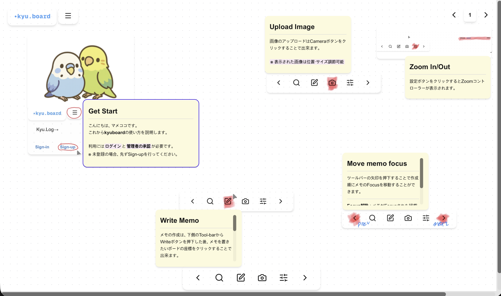

# KyuBoard v1.0 Beta

KyuBoard is a spatial Markdown board for capturing fragmented ideas and compiling them into a single Markdown document.

Instead of writing from top to bottom, users can place memos, images, tables, and diagrams freely across a visual workspace. KyuBoard then interprets the arrangement using deterministic rules and converts the board into structured Markdown.



## Concept

Thoughts do not always appear in a linear order.

A conventional Markdown editor requires the document structure to be decided while writing. KyuBoard separates these two processes.

Users first record and arrange individual pieces of information on a board. Once the ideas have taken shape, the board can be compiled into a single Markdown document.

KyuBoard aims to provide freedom without making the workspace directionless. Search, memo-order navigation, zoom controls, and Markdown compilation help users move between spatial thinking and structured documentation.

## How It Works

KyuBoard treats the board itself as part of the document structure.

- Memo creation order determines the basic document order.
- Images, tables, and Mermaid diagrams can be associated with memos through their positions.
- Each corner of a memo acts as a connection point.
- When multiple cards overlap the same connection point, the card with the highest layer is selected.
- The resulting structure is compiled into a single Markdown document.

This approach avoids explicit group management while keeping the compilation result predictable and controllable.

## Core Features

### Board Workspace

Arrange information freely within a finite visual workspace.

Cards can be moved and resized, allowing users to organize ideas spatially before deciding on the final document structure.

### Rich Text Memos

Memo cards are the foundation of KyuBoard.

Memos support rich text editing through Tiptap, including headings, lists, quotes, links, and code blocks.

### Image Cards

Upload and arrange images directly on the board.

Images can be spatially associated with memo cards and included in the compiled Markdown document.

### Table Cards

Create lightweight tables for organizing structured information.

Tables are converted into Markdown table syntax during compilation.

### Mermaid Cards

Write Mermaid syntax and preview the rendered diagram directly on the board.

Mermaid cards are preserved as Mermaid code blocks in the generated Markdown.

### Spatial Markdown Compiler

Compile the contents of a board into a single Markdown document.

The compiler uses memo order, card positions, memo corners, and layer information to determine the output structure without requiring separate grouping data.

### Markdown Viewer

Preview the compiled Markdown directly inside KyuBoard.

The viewer supports standard Markdown, GitHub Flavored Markdown, raw HTML sanitization, tables, images, and Mermaid diagrams.

### Search and Navigation

Search memo contents and move through memos according to their creation order.

These tools help users navigate larger boards without imposing a fixed document layout during the thinking process.

### Zoom Controls

Adjust the board scale for different devices and working styles.

KyuBoard supports desktop, tablet, and mobile interaction.

### Authentication and Permissions

KyuBoard uses a sign-in and approval-based permission system.

Users can create accounts, but editing operations are restricted until permission is granted. Board creation is limited to administrator accounts.

## Design Principles

### Spatial First

Ideas are recorded and arranged before they are converted into a linear document.

### Deterministic Compilation

KyuBoard does not attempt to infer document meaning through AI.

The same board arrangement produces the same Markdown structure according to explicit spatial rules.

### Minimal Interface

Controls are intentionally given lower visual priority so that the board content remains the main focus.

### Limited but Expressive Tools

KyuBoard uses a small set of card types rather than attempting to provide every possible editing feature.

The goal is to create varied expressions through simple, predictable components.

## Tech Stack

- Next.js 16
- React 19
- TypeScript
- Tailwind CSS
- Drizzle ORM
- Neon PostgreSQL
- Tiptap
- react-rnd
- Mermaid
- React Markdown
- Cloudinary
- Vercel Analytics

## Getting Started

Install dependencies:

```bash
npm install
```

Create a local environment file:

```env
NEON_CONNECTION_STRING=
AUTH_SECRET=
CLOUDINARY_CLOUD_NAME=
CLOUDINARY_API_KEY=
CLOUDINARY_API_SECRET=
```

Run the development server:

```bash
npm run dev
```

Open the application:

```text
http://localhost:3000
```

## Scripts

```bash
npm run dev
npm run build
npm run start
npm run lint
```

## Database

KyuBoard uses Neon PostgreSQL through Drizzle ORM.

Main tables include:

- `users`
- `boards`
- `memos`
- `images`
- `mermaids`
- `tables`

User accounts contain permission and role information used to control editing access and board creation.

## Deployment

KyuBoard is designed to run on Vercel.

Configure the same environment variables in the Vercel project settings before deployment.

Cloudinary is used for image storage, while Neon PostgreSQL stores board and card data.

## Current Status

KyuBoard is currently in Beta.

The main board-editing and Markdown-compilation workflows are implemented. Current development focuses on:

- automated testing
- interaction stability
- mobile and tablet usability
- input validation and security
- performance improvements
- documentation updates

## Philosophy

KyuBoard is not simply a Markdown editor displayed on a canvas.

It is a workspace where fragmented thoughts can first exist as independent spatial objects and later become a structured document.

The board is where ideas take shape.

Markdown is the compiled result.
