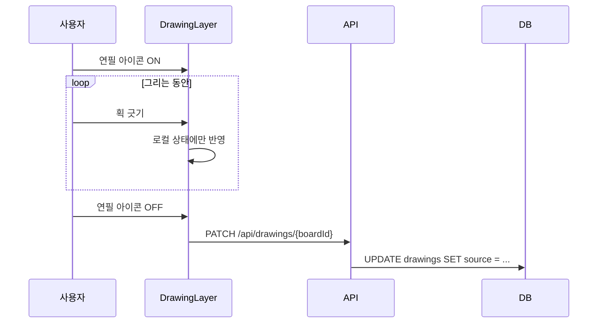

# KyuBoard 드로잉 레이어 기본설계서

> 상태: 1차 구현 반영
> 대상: 보드 위 자유 필기 주석 기능

## 1. 개요

보드 표면에 직접 선을 긋는 주석 기능을 추가한다. 메모·이미지·Mermaid·표에 이어지는 다섯 번째 카드가 **아니라**, 카드들 위에 덮이는 별도의 레이어다.

용도는 **표시**다. 동그라미를 치고, 밑줄을 긋고, 화살표를 하나 그어 강조하는 것. 그림을 그리는 도구가 아니다.

## 2. 설계 원칙

이 기능의 범위는 아래 네 가지 결정으로 정해진다. 각 결정은 특정 문제군을 통째로 제거한다.

| 결정 | 대신 포기한 것 | 제거된 문제 |
| --- | --- | --- |
| 그림이 아니라 **주석** | 빠르고 표현적인 획 | 입력 지연. 느린 획에서는 체감되지 않음 |
| **현실의 법칙**을 따름 | 카드에 붙어 따라오는 주석 | 앵커링, 부모-자식 관계, 좌표 재계산 |
| **보드당 한 행** | 획 단위 증분 저장 | 큐, append 의미론, 카드 생성 경쟁 조건 |

### 2.1 현실의 법칙

화이트보드에 포스트잇을 붙이고 옆에 마커로 표시했다면, 포스트잇을 옮겨도 마커 자국은 제자리에 남는다. 이 앱도 동일하게 동작한다.

- 획은 보드 절대 좌표를 갖는다.
- 카드를 옮겨도 획은 따라가지 않는다.
- 어긋나면 지우고 다시 긋는다.

이는 제약이 아니라 사용자가 이미 알고 있는 규칙이다. 별도의 학습이나 UI가 필요 없다.

### 2.2 문서에 포함되지 않음

Markdown 컴파일 대상이 아니다. 회의 후 화이트보드 내용을 옮겨 적을 때 포스트잇의 글은 옮기지만 마커로 친 동그라미는 옮기지 않는 것과 같다.

따라서 획은 KyuBoard의 세 번째 층에 해당한다.

| 층 | 담당 | 문서 반영 |
| --- | --- | --- |
| 시간축 (메모 순서) | 글의 흐름 | O |
| 공간축 (카드 배치) | 콘텐츠 귀속 | O |
| **보드 전용 층 (획)** | 작업 중 표시 | **X** |

## 3. 데이터 모델

### 3.1 테이블

```sql
CREATE TABLE drawings (
    drawing_id  serial PRIMARY KEY,
    board_id    integer NOT NULL UNIQUE REFERENCES boards(board_id) ON DELETE CASCADE,
    source      jsonb   NOT NULL DEFAULT '[]'::jsonb,
    created_at  timestamp NOT NULL DEFAULT now(),
    updated_at  timestamp NOT NULL DEFAULT now()
);
```

`board_id`에 `UNIQUE`를 걸어 "보드당 한 행"을 DB 제약으로 강제한다.

기존 카드 테이블과 달리 `x`, `y`, `z`, `width`, `height`가 없다. 카드가 아니므로 위치를 가질 필요가 없고, 좌표는 각 점이 직접 들고 있다.

### 3.2 획 구조

```json
[
  {
    "id": "a1b2c3d4",
    "color": "#1f2937",
    "width": 3,
    "points": [[200, 300], [200, 308], [201, 317], [201, 326]]
  }
]
```

- `id` — 클라이언트에서 생성. 삭제 시 대상 지정에 사용
- `points` — `[x, y]` 보드 절대 좌표 배열
- 필압·기울기는 저장하지 않는다 (3.4 참고)

`crypto.randomUUID()`는 보안 컨텍스트(HTTPS 또는 localhost)에서만 동작한다. LAN IP로 접속해 확인하는 개발 환경에서는 쓸 수 없으므로 `createStrokeId()`를 직접 둔다. 보드 안에서만 구분되면 되므로 시각과 난수 조합으로 충분하다.

### 3.3 검증 스키마

```ts
// lib/board-stroke.ts
const pointSchema  = z.tuple([z.number(), z.number()]);
const strokeSchema = z.object({
    id:     z.string().min(1),
    color:  z.string().min(1),
    width:  z.number().positive(),
    points: z.array(pointSchema).min(2),
});
export const boardStrokesSchema = z.array(strokeSchema);
```

`lib/table-card.ts`의 `tableSourceSchema`와 동일한 패턴을 따른다.

### 3.4 용량 추정

| 단위 | 크기 |
| --- | --- |
| 획 하나 (점 40개) | 약 750 B |
| 손글씨 "hello world" 한 줄 (획 13개) | 약 5 KB |
| 주석이 많은 보드 하나 | 약 40 KB |
| 보드 20개 전체 | 약 800 KB |

Neon 무료 플랜 한도의 0.2% 수준이다. 필압까지 저장하면 점당 크기가 1.5배가 되나, 주석 범위에서는 시각적 이득이 크지 않아 제외한다.

## 4. 좌표계

획은 **보드 절대 좌표**로 저장한다. 어떤 줌 배율에서 그렸는지와 무관하게 값 자체로 완결된다.

### 4.1 캡처 (화면 → 보드)

```ts
const toBoard = (e: React.PointerEvent): [number, number] => {
    const rect = svgRef.current!.getBoundingClientRect();
    return [
        (e.clientX - rect.left) / zoom,
        (e.clientY - rect.top)  / zoom,
    ];
};
```

`useBoardMemos.getMemoAutoLocation()`이 메모 생성 위치를 `/ boardZoom` 하는 것과 같은 규칙이다.

### 4.2 렌더 (보드 → 화면)

계산하지 않는다. SVG를 `.kyu-board` 내부에 배치하면 이미 걸려 있는 `transform: scale(boardZoom)`이 자동으로 적용된다.

## 5. 렌더링

### 5.1 구조

```
.kyu-board (transform: scale(zoom))
├── ImageCard / MemoCard / MermaidCard / TableCard   (z: 1..n)
└── <svg> 드로잉 오버레이                              (항상 최상단)
```

카드들의 z 통합 정렬 체계에 참여하지 않는다. 주석은 항상 위에 보인다.

### 5.2 경로 변환

점을 직선으로 이으면 각져 보이므로, 각 점을 제어점으로 하고 다음 점과의 중점을 끝점으로 하는 2차 베지에를 사용한다.

```ts
const toPath = (points: [number, number][]) => {
    let d = `M ${points[0][0]} ${points[0][1]}`;
    for (let i = 1; i < points.length - 1; i++) {
        const [x1, y1] = points[i];
        const [x2, y2] = points[i + 1];
        d += ` Q ${x1} ${y1} ${(x1 + x2) / 2} ${(y1 + y2) / 2}`;
    }
    return d;
};
```

외부 라이브러리를 쓰지 않는다. SVG와 포인터 이벤트는 브라우저 기본 기능이다.

## 6. 모드 전환

메인 툴바의 연필 아이콘으로 드로잉 모드를 켠다. 드로잉 모드 안에는 하위 도구가 세 개 있다.

| 하위 도구 | 오버레이 `pointer-events` | `touch-action` | 보드 패닝 | 동작 |
| --- | --- | --- | --- | --- |
| **그리기** (기본) | `auto` | `none` | 차단 | 선을 긋는다 |
| **패닝** | `auto` | 없음 | 허용 | 보드만 움직인다 |
| **지우기** | `auto` | `none` | 차단 | 원형 영역에 닿은 부분을 지운다 |
| (모드 꺼짐) | `none` | 없음 | 허용 | 기존과 동일 |

세 하위 도구 모두 `pointer-events: auto`를 유지한다. 그래야 드로잉 모드 내내 카드 조작이 막힌다. 패닝 도구는 카드를 만지게 하려는 것이 아니라 화면만 움직이려는 것이다.

`touch-action`은 **그리거나 지울 때만** 건다. 드로잉 모드가 꺼져 있을 때까지 남겨두면 아래쪽 요소의 터치를 방해할 수 있다.

입력 타입(`pointerType`)은 구분하지 않는다. 마우스·터치·펜슬 모두 동일하게 처리한다.

### 6.1 다른 카드 동작 차단

두 경로를 각각 막는다.

**보드 위** — 오버레이가 `pointer-events: auto`로 입력을 가로채므로 카드에 닿지 않는다.

**툴바** — 오버레이 바깥이라 따로 처리한다. `BoardToolBar`는 `cardEditing`이 참일 때 메인 버튼 묶음을 통째로 감추므로, 여기에 `drawingMode`를 얹는다.

```tsx
<BoardToolBar cardEditing={isEditing || drawingMode} ... />
```

`BoardClient`의 `isEditing` 자체에는 섞지 않는다. `isEditing`은 `useBoardScroll`로도 전달되는데, 그 훅에서 `cardEditing`은 **패닝과 무관하며 카드 편집용 스크롤 잠금을 켜는 값**이다. 드로잉 모드를 합치면 관계없는 잠금이 걸린다.

### 6.2 보드 패닝 차단

`useBoardScroll.canStartBoardPan()`의 제외 선택자에 오버레이를 추가한다.

```ts
"[data-editing='true'], [data-drawing-capture='true'], .board-toolbar, ..."
```

오버레이는 그리기·지우기일 때만 `data-drawing-capture="true"`를 단다. 패닝 도구에서는 속성을 떼므로 같은 코드가 패닝을 허용한다. 기존 훅에 추가되는 변경은 이 선택자 한 항목뿐이다.

### 6.3 그리기 도구

`DrawingToolBar`가 `CardToolPortal`로 카드 툴바와 같은 자리에 나타난다. 구성은 `MemoToolBar`의 색상 선택 구조를 따른다.

| 도구 | 동작 |
| --- | --- |
| 펜 색상 | 프리셋 5색 (Ink / Red / Blue / Green / Amber) |
| 펜 굵기 | 프리셋 3단계 (2 / 4 / 8) |
| 지우기 | 켜고 끄는 토글. 켜지면 아이콘이 핑크 |
| 손바닥 | 켜고 끄는 토글. 켜지면 아이콘이 핑크 |
| 되돌리기 | 마지막 획 삭제 |
| 완료 | 드로잉 모드 종료 및 저장 |

지우기와 손바닥은 서로를 대체한다. 켜져 있는 쪽을 다시 누르면 기본인 그리기로 돌아간다.

색상과 굵기는 획마다 저장되므로, 툴바의 값은 다음에 그을 획에만 적용된다. 이미 그은 획은 변하지 않는다.

### 6.4 원형 지우개

지우개는 획을 통째로 지우지 않는다. 원 안에 들어온 **점만** 지우고, 남은 구간을 각각 독립된 획으로 쪼갠다.

```
지우기 전:  ●─●─●─●─●
원이 가운데 점을 덮음
지운 후:    ●─●     ●─●   (획 두 개)
```

- 점이 하나만 남는 구간은 선이 될 수 없으므로 버린다
- 지워진 점이 없으면 원본 배열을 **같은 참조로** 돌려준다. 저장 여부 판단과 리렌더 방지에 쓰인다
- 반지름은 화면 기준 값이라 보드 좌표로 쓸 때 줌으로 나눈다. 배율이 달라져도 지우개 크기가 같아 보인다

## 7. 저장 흐름

그리기 모드가 켜져 있는 동안에는 프론트엔드 상태로만 동작한다. **모드를 끄는 순간 한 번 저장한다.**



메모가 바깥 클릭 시점에 저장되는 것과 같은 구조다. 모드 오프가 "편집 종료" 신호 역할을 한다.

- 세션당 쓰기 **1회**
- 디바운스·큐·배치 전송 없음
- 사용자가 커밋 시점을 명확히 인지함

## 8. 변경 대상

| 파일 | 구분 | 내용 |
| --- | --- | --- |
| `lib/board-stroke.ts` | 신규 | zod 스키마, `toPath` |
| `lib/db/schema.ts` | 수정 | `db_drawings` 추가 |
| `docs/drawings.sql` | 신규 | 수동 DDL |
| `app/api/drawings/[boardId]/route.ts` | 신규 | GET / PATCH |
| `hooks/useBoardDrawing.ts` | 신규 | 획 상태, 하위 도구, 펜 설정, 저장 |
| `components/DrawingLayer.tsx` | 신규 | SVG 오버레이, 원형 지우개 |
| `components/DrawingToolBar.tsx` | 신규 | 펜 색상·굵기·지우기·손바닥·되돌리기·완료 |
| `components/BoardToolBar.tsx` | 수정 | 연필 토글 버튼 |
| `components/BoardClient.tsx` | 수정 | 훅 연결, 레이어 배치 |
| `hooks/useBoardScroll.ts` | 수정 | 패닝 제외 선택자에 한 항목 추가 |
| `app/boards/[boardId]/page.tsx` | 수정 | 초기 획 조회 |
| `tests/unit/board-stroke.test.ts` | 신규 | 스키마, `strokeToPath`, 원형 지우개 |
| `tests/unit/useBoardDrawing.test.ts` | 신규 | 하위 도구, 저장 시점, 부분 지우기 |
| `tests/unit/DrawingLayer.test.tsx` | 신규 | 모드별 `pointer-events`·`touch-action`·패닝 차단 |

권한 처리는 기존 카드 API와 동일하게 `getCardPermissionMessage()`를 사용한다.

저장은 `board_id`의 `UNIQUE` 제약을 이용해 `onConflictDoUpdate`로 처리한다. 최초 생성과 갱신이 한 문으로 끝나므로 행이 중복 생성될 여지가 없다.

## 9. 범위 외

의도적으로 제외한 항목. 나중에 다시 꺼낼 때 근거를 남긴다.

| 항목 | 제외 사유 |
| --- | --- |
| 필압·기울기 | 주석 범위에서 시각적 이득 대비 데이터·복잡도 증가 |
| `perfect-freehand` 등 라이브러리 | 위와 동일 |
| 카드 앵커링 | 현실의 법칙에 위배. 사용자 기대와 어긋남 |
| Markdown 컴파일 포함 | 획은 결과물이 아니라 작업 중 표시 |
| 실시간 증분 저장 | 모드 오프 저장으로 대체 |
| Apple Pencil 전용 처리 | 입력 타입 분기 복잡도 대비 이득 없음 |
| 필기 인식(OCR) | 범위 밖 |

## 10. 알려진 제약

- **네이티브 앱 수준의 필기감은 나오지 않는다.** WebKit이 `desynchronized` 캔버스와 `getPredictedEvents()`를 제공하지 않아 입력 지연을 줄일 수단이 없다. 천천히 긋는 주석에서는 체감되지 않으나, 빠르게 그으면 선이 따라온다.
- **손글씨는 앱의 텍스트 기능에서 보이지 않는다.** 획 데이터에는 문자 정보가 없으므로 검색(`useBoardSearch`)에 잡히지 않고 복사도 되지 않는다. 메모를 대체하는 용도로는 사용할 수 없다.
- **그리기 모드 중 탭이 닫히면 유실된다.** 필요 시 `visibilitychange` + `sendBeacon`으로 보완 가능(11.2).
- **아이패드(WebKit)에서의 동작은 미검증이다.** 이 작업 환경에서는 WebKit 브라우저를 받을 수 없어 Chromium으로만 확인했다. 터치 무시 현상은 `touch-action`을 조건부로 바꾸는 것으로 대응했으나, 실기 확인이 필요하다.
- **`pointermove`마다 리렌더가 발생한다.** 주석 규모에서는 문제없을 것으로 보이나, 지연이 느껴지면 진행 중인 획만 `ref`로 직접 `<path>`의 `d`를 갱신하도록 전환한다.

## 11. 결정 및 미결정

### 11.1 결정된 항목

| 항목 | 결정 |
| --- | --- |
| 컬럼명 | `source` — 기존 `mermaids`·`tables`와 일관되게 |
| 색상·굵기 | 프리셋 제공 (색상 5개, 굵기 3단계). 슬라이더·커스텀 팔레트는 제외 |
| 되돌리기 | 마지막 획 삭제로 제공. 모드 오프 전까지 로컬 상태라 비용이 낮음 |
| 지우개 | 원형 영역에 닿은 부분만 삭제. 획 통째 삭제와 전체 지우기는 제외 |
| 패닝 | 드로잉 모드 안의 하위 도구로 제공. 손바닥 아이콘 토글 |

### 11.2 미결정 항목

**유실 방지** — 그리기 모드 중 탭이 닫히면 저장되지 않은 획이 사라진다. `visibilitychange` + `sendBeacon`으로 보완할 수 있으나, 획은 다시 그릴 수 있는 데이터이므로 필수는 아니다. 현재 미적용.

**지우개 정밀도** — 현재는 획의 *점*이 원 안에 들어왔는지만 본다. 점 간격이 지우개 지름보다 넓으면 원이 선분 사이를 지나가도 안 지워질 수 있다. 실사용 표본 간격에서는 문제되지 않을 것으로 보나, 필요하면 점-선분 거리 판정으로 바꾼다.

**필기 성능** — `pointermove`마다 리렌더가 발생하는 현재 구조로 충분한지는 실기에서 확인이 필요하다. 부족하면 진행 중인 획만 `ref`로 직접 갱신하도록 전환한다.
