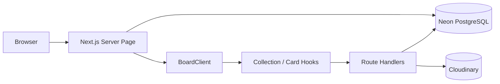
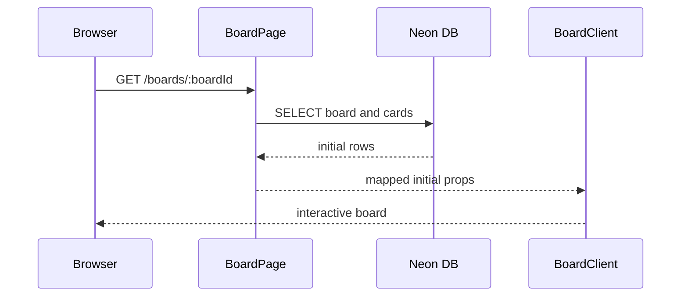
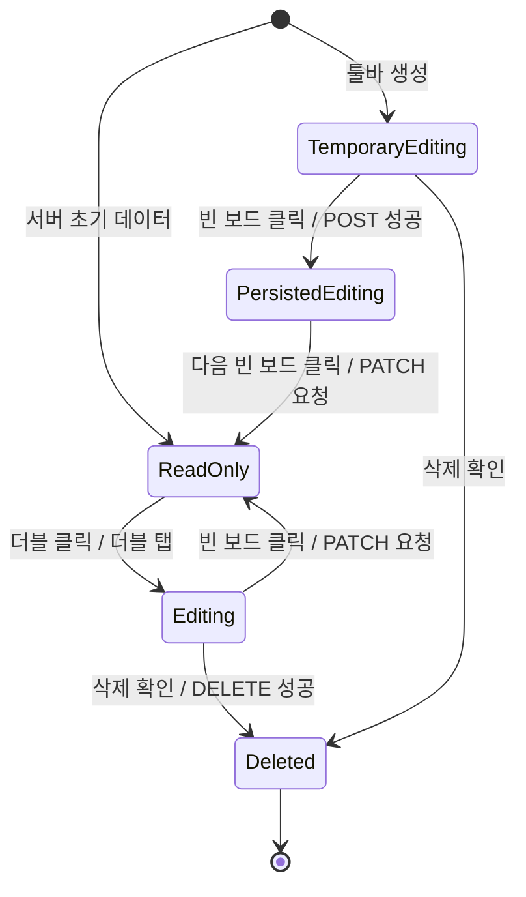
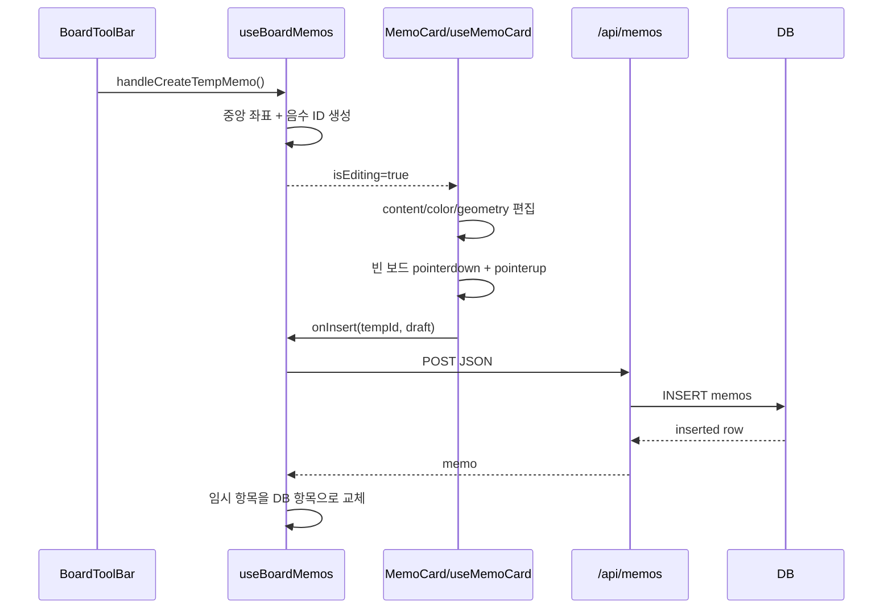
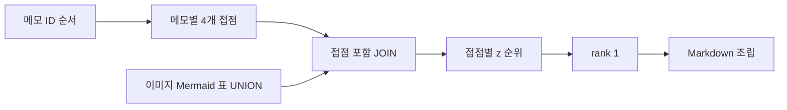
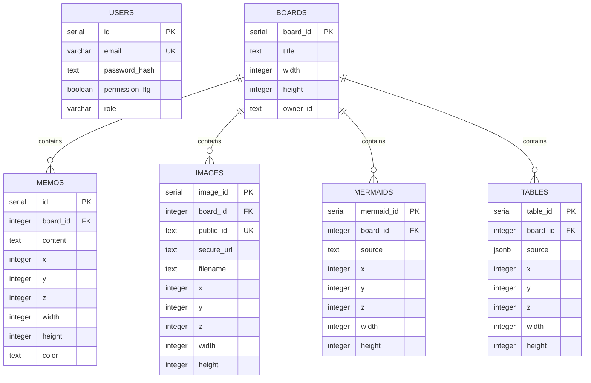

# KyuBoard 상세설계서

> 기준 소스: commit `92ae0dc`  
> 목적: 현재 구현된 KyuBoard의 실행 흐름과 컴포넌트·훅·API·DB 연결 관계를 실제 소스 기준으로 설명한다.

## 1. 시스템 개요

KyuBoard는 큰 2차원 보드 위에 메모, 이미지, Mermaid 다이어그램, 표 카드를 자유롭게 배치하는 Next.js 애플리케이션이다.

- 서버 컴포넌트가 Neon PostgreSQL에서 보드와 카드 초기 데이터를 조회한다.
- `BoardClient`가 네 종류 카드 컬렉션과 현재 편집 상태를 조정한다.
- 컬렉션 훅이 임시 카드 생성과 API 통신을 담당한다.
- 개별 카드 훅이 카드 초안, 좌표, 크기와 외부 클릭 저장을 담당한다.
- 편집 중인 카드는 `react-rnd`로 이동·크기 조절한다.
- 카드 전용 도구는 Portal을 통해 우측 고정 툴바 영역에 표시한다.
- 카드의 공간 배치를 해석해 하나의 Markdown 문서로 컴파일할 수 있다.



## 2. 기술 구성

| 영역 | 구현 |
| --- | --- |
| 애플리케이션 | Next.js 16 App Router, React 19, TypeScript |
| 스타일 | Tailwind CSS 4, 전역 CSS |
| DB | Neon PostgreSQL, Drizzle ORM |
| 인증 | HttpOnly 쿠키, HMAC-SHA256 서명 토큰, scrypt 비밀번호 해시 |
| 카드 이동 | `react-rnd` |
| 메모 편집 | TipTap StarterKit, Highlight, HardBreak |
| 다이어그램 | Mermaid, Mermaid ZenUML 플러그인 |
| 표 | TanStack React Table |
| 이미지 | Next Image, Cloudinary |
| Markdown | Turndown, React Markdown, remark-gfm, rehype-raw, rehype-sanitize |
| 테스트 | Vitest, Testing Library, jsdom, Playwright 기반 |

주요 설정은 [package.json](../package.json), [next.config.ts](../next.config.ts), [vitest.config.ts](../vitest.config.ts), [compose.yaml](../compose.yaml)에 있다.

## 3. 화면 진입 흐름

### 3.1 보드 목록 `/`

1. [app/page.tsx](../app/page.tsx)가 요청마다 `connection()` 이후 `boards`를 ID 오름차순으로 조회한다.
2. 조회 결과를 [BoardList](../components/BoardList.tsx)에 전달한다.
3. `BoardList`는 인증 상태와 목록 UI 상태를 각각 `useBoardAuth`, `useBoardList`에서 가져온다.
4. 보드 카드를 누르면 `/boards/{boardId}`로 이동한다.
5. 관리자만 보드 생성, 이름 변경, 삭제 API를 호출할 수 있다.

보드 미리보기는 `iframe`으로 보드 URL을 불러온다. `sandbox=""`와 `pointerEvents: "none"`이 적용되어 상호작용 없는 초기 화면 미리보기 역할만 한다.

### 3.2 보드 화면 `/boards/[boardId]`

[app/boards/[boardId]/page.tsx](../app/boards/[boardId]/page.tsx)는 서버에서 현재 보드, 메모, 이미지, Mermaid, 표를 차례로 조회한다. DB 컬럼명을 클라이언트 타입에 맞게 변환한 뒤 [BoardClient](../components/BoardClient.tsx)에 전달한다.



## 4. 프론트엔드 계층

```text
app/boards/[boardId]/page.tsx
└── BoardClient
    ├── BoardMenu
    │   └── BoardMarkdownView
    ├── BoardToolBar
    │   ├── BoardZoomControl
    │   └── #card-tool-portal
    ├── BoardSearchPanel
    ├── SignInModal / SignUpModal
    ├── BoardMessage
    └── .board-scroll-layer
        └── .board-size-layer
            └── .kyu-board
                ├── MemoCard[] -> MemoEditor / MemoToolBar
                ├── ImageCard[] -> ImageToolBar
                ├── MermaidCard[] -> MermaidToolBar
                └── TableCard[] -> TableGrid / TableToolBar
```

## 5. 상태 소유권

### 5.1 BoardClient 조정 상태

| 상태 | 소유 위치 | 용도 |
| --- | --- | --- |
| `boardZoom` | `useBoardZoom` | 보드 확대율 |
| `currentUser` | `useBoardAuth` | 현재 로그인 사용자 |
| `memos` / `editingMemoId` | `useBoardMemos` | 메모 컬렉션과 편집 대상 |
| `images` / `editingImageId` | `useBoardImages` | 이미지 컬렉션과 편집 대상 |
| `mermaids` / `editingMermaidId` | `useBoardMermaids` | Mermaid 컬렉션과 편집 대상 |
| `tables` / `editingTableId` | `useBoardTables` | 표 컬렉션과 편집 대상 |
| `focusedMemoId` | `useBoardMemoFocus` | 한 번 클릭·검색 이동 대상 |
| 검색어·검색 인덱스 | `useBoardSearch` | 메모 내용 검색 |
| 패닝 상태 | `useBoardScroll` | 마우스 보드 이동 |
| 메뉴·Markdown 모달 | `BoardClient` | 화면 수준 UI |

`editingMemoId`, `editingImageId`, `editingMermaidId`, `editingTableId`는 서로 독립적이다. 통합 `isEditing`은 네 상태 중 하나라도 값이 있으면 `true`다.

### 5.2 확정 상태와 편집 초안

카드 상태는 두 단계로 존재한다.

1. 컬렉션 훅의 확정 상태
   - `memos`, `images`, `mermaids`, `tables`
   - 서버 초기 조회와 API 성공 결과를 반영한다.
2. 개별 카드 훅의 편집 초안
   - 내용, 좌표, 크기, 색상을 카드 단위로 유지한다.
   - 빈 보드 클릭 시 컬렉션 훅의 `onInsert` 또는 `onUpdate`로 전달한다.

드래그와 입력 중에는 API를 호출하지 않고 편집 종료 시점에 저장한다.

## 6. 보드 좌표와 확대

### 6.1 DOM 레이어

| 레이어 | 역할 |
| --- | --- |
| `.board-scroll-layer` | 실제 스크롤 컨테이너이자 `cardLocationRef` 대상 |
| `.board-size-layer` | `width * zoom`, `height * zoom`으로 스크롤 영역 확보 |
| `.kyu-board` | 논리 보드 크기를 유지하고 `transform: scale(zoom)` 적용 |

카드의 `x`, `y`, `width`, `height`는 확대 전 보드 좌표계 기준이며 DB에도 같은 값이 저장된다. `x`, `y` 기준점은 카드의 좌측 상단이다.

### 6.2 화면 중앙 자동 배치

```ts
const centerX = (scrollLeft + clientWidth / 2) / boardZoom;
const centerY = (scrollTop + clientHeight / 2) / boardZoom;

const x = Math.max(0, centerX - cardWidth / 2);
const y = Math.max(0, centerY - cardHeight / 2);
```

| 카드 | 기본 크기 |
| --- | --- |
| 메모 | 300 x 200 |
| 이미지 | 원본 비율 유지, 최대 400 x 300 |
| Mermaid | 480 x 360 |
| 표 | 560 x 360, 최소 360 x 240 |

모든 카드는 `react-rnd`의 `bounds="parent"`와 `scale={zoom}`을 사용한다. 드래그·리사이즈 완료 값을 초안에 기록하고 저장 시 정수로 반올림한다.

## 7. 공통 카드 생명주기



### 7.1 임시 ID

새 카드는 `-Date.now()`를 ID로 사용한다. 음수 ID 여부로 저장을 분기한다.

```ts
if (card.id < 0) {
    onInsert(draft);
} else {
    onUpdate(draft);
}
```

- 임시 카드 삭제는 API 없이 로컬 배열에서 제거한다.
- 저장 성공 시 API가 반환한 양수 DB ID로 임시 항목을 교체한다.
- 음수 ID의 레이어 변경은 API를 호출하지 않는다.

### 7.2 편집 진입과 표현

- 데스크톱: `onDoubleClick`
- 터치: 300ms 이내 두 번의 `pointerdown`
- 권한 없음: `onPermissionDenied` 후 중단
- 권한 있음: 카드 종류별 `editing...Id` 설정
- 편집 카드: `data-editing="true"`, `.card-editing`, `z-index: 49999`
- 일반 보드 툴바 숨김, 카드 전용 툴바 표시
- 메모·Mermaid·표는 하단 핸들로 이동하며 이미지는 카드 전체가 이동 영역이다.
- 메모는 한 번 클릭 시 `focusedMemoId`만 설정하며 편집과 구분한다.

### 7.3 외부 클릭 저장

저장 대상으로 인정되는 영역은 `.board-scroll-layer` 안이면서 현재 카드와 `.board-toolbar` 밖인 지점이다.

메모, Mermaid, 표는 `pointerdown`과 `pointerup`이 모두 빈 보드에서 발생했는지 `outsidePressStartedRef`로 확인한다. 카드 내부에서 드래그를 시작해 외부에서 손을 뗀 경우에는 저장하지 않는다. 표는 `.confirm-dialog`도 제외한다.

이미지는 현재 `pointerup` 위치만 검사하고 `setTimeout(..., 0)`으로 저장한다. 다른 세 카드와 판정 방식이 다르다.

## 8. 카드별 상세 흐름

### 8.1 메모 카드

관련 소스: [MemoCard.tsx](../components/MemoCard.tsx), [useMemoCard.ts](../hooks/useMemoCard.ts), [useBoardMemos.ts](../hooks/useBoardMemos.ts), [MemoEditor.tsx](../components/MemoEditor.tsx)



`MemoEditor`는 HTML 문자열을 입출력한다.

- `onUpdate`에서 `editor.getHTML()`을 메모 초안에 반영한다.
- 외부 content 변경은 `setContent(..., { emitUpdate: false })`로 동기화한다.
- `useImperativeHandle`로 카드 툴바에 H1-H6, Bold, Italic, Strike, Divider, Highlight, Code Block, Block Quote 명령을 노출한다.
- `**bold**`, `*italic*`, `~~strike~~`, inline code, `==highlight==` 입력·붙여넣기 규칙을 추가했다.
- `Shift+Enter`는 HardBreak다.
- 읽기 상태는 저장 HTML을 `dangerouslySetInnerHTML`로 출력한다.

### 8.2 이미지 카드

관련 소스: [ImageCard.tsx](../components/ImageCard.tsx), [useImageCard.ts](../hooks/useImageCard.ts), [useBoardImages.ts](../hooks/useBoardImages.ts), [images API](../app/api/images/route.ts)

업로드 흐름:

1. 브라우저 `Image`와 `canvas`로 파일을 디코딩한다.
2. 긴 변을 최대 2000px로 축소한다.
3. PNG Blob이 4MB 이하가 될 때까지 가로·세로를 85%씩 반복 축소한다.
4. 임시 Object URL과 음수 ID로 보드 중앙에 표시한다.
5. 빈 보드 클릭 시 multipart 요청으로 업로드한다.
6. Cloudinary `kyuboard/boards/{boardId}` 폴더에 저장한다.
7. `public_id`, `secure_url`과 카드 좌표를 DB에 저장한다.
8. 임시 URL을 revoke하고 API 응답으로 교체한다.

압축 오류 시 원본 파일을 사용한다. 삭제는 Cloudinary 파일을 먼저 삭제한 뒤 DB 행을 삭제한다.

### 8.3 Mermaid 카드

관련 소스: [MermaidCard.tsx](../components/MermaidCard.tsx), [useMermaidCard.ts](../hooks/useMermaidCard.ts), [useMermaidRenderer.ts](../hooks/useMermaidRenderer.ts)

편집 상태는 상단 40% 소스 textarea와 하단 실시간 SVG를 표시하고, 읽기 상태는 SVG만 표시한다.

렌더링 흐름:

1. Mermaid를 `securityLevel: "strict"`로 초기화하고 ZenUML 플러그인을 등록한다.
2. 소스 변경 시 `parse` 후 `render`한다.
3. SVG의 고정 `width`, `height`를 제거한다.
4. `preserveAspectRatio="xMidYMid meet"`를 추가한다.
5. ticket ref로 이전 비동기 렌더 결과를 무시한다.
6. Mermaid 임시 DOM과 Tailwind 변수를 오염시키는 ZenUML 전역 스타일을 제거한다.
7. 전역 `.mermaid-rendered svg` 스타일로 카드 크기에 맞춘다.

### 8.4 표 카드

관련 소스: [TableCard.tsx](../components/TableCard.tsx), [TableGrid.tsx](../components/TableGrid.tsx), [useTableCard.ts](../hooks/useTableCard.ts), [useTableEdit.tsx](../hooks/useTableEdit.tsx), [table-card.ts](../lib/table-card.ts)

```ts
type TableSource = {
    columns: Array<{ id: string; name: string; width?: number }>;
    rows: Array<{ id: string; cells: Record<string, string> }>;
};
```

DB에는 `jsonb`로 저장하며 API는 Zod schema로 검증한다. `useTableEdit`는 정렬, 열·전체 필터, 행 선택, 열 순서·표시·고정·크기, 그룹화·펼침, 페이지네이션 상태를 소유한다.

행·열 추가, 셀 편집, 열 이름 변경과 삭제 UI는 KyuBoard 코드가 구현한다. `sourceRef`는 콜백이 최신 source를 읽도록 하며, 열 정의는 `columnStructureKey`가 바뀔 때 재계산해 셀 input 재마운트를 줄인다.

## 9. 카드 툴바와 Portal

[BoardToolBar](../components/BoardToolBar.tsx)는 우측 하단에 일반 도구와 빈 `#card-tool-portal`을 만든다. 카드 편집 중에는 일반 도구를 숨기고 [CardToolPortal](../components/CardToolPortal.tsx)이 같은 위치에 전용 도구를 렌더링한다. 줌 컨트롤은 항상 유지된다.

| 툴바 | 기능 |
| --- | --- |
| 보드 | 이전/다음 메모, 검색, 메모·이미지·표·Mermaid 생성 |
| 메모 | 색상, 텍스트 형식, 블록 형식, 앞으로, 뒤로, 삭제 |
| 이미지 | 앞으로, 뒤로, 삭제 |
| Mermaid | 앞으로, 뒤로, 삭제 |
| 표 | 앞으로, 뒤로, 삭제 |

툴바 진입 효과는 `.toolbar-reveal`의 900ms blur/opacity/transform 애니메이션이다.

## 10. 보드 패닝과 입력 보호

[useBoardScroll](../hooks/useBoardScroll.ts)은 마우스 왼쪽 버튼 패닝을 담당한다.

패닝 시작 제외 대상:

```text
[data-editing='true'], .board-toolbar, .confirm-dialog,
button, input, textarea, a, [contenteditable='true']
```

패닝 시작 조건은 누른 후 160ms 경과와 이동 거리 5px 이상이다. 조건 충족 시 pointer capture하고 이동량만큼 `scrollLeft`, `scrollTop`을 변경한다.

카드 편집 중에는 텍스트 커서 이동과 텍스트 드래그로 부모 보드가 스크롤되는 것을 다음 방식으로 막는다.

- 방향키 입력 직전 보드 스크롤 좌표 저장
- 160ms 동안 `keyboardScrollRef` 유지
- 보드 scroll 이벤트 발생 시 저장 좌표로 복구
- 편집 가능 요소가 아닌 곳의 방향키는 `preventDefault`
- input, textarea, contenteditable의 포인터 드래그가 끝날 때까지 보드 좌표 고정

## 11. 메모 탐색과 검색

`useBoardMemoFocus`는 메모 ID를 오름차순으로 정렬한다. 최초 로드 시 가장 작은 ID를 포커스하고, 이전·다음 이동은 `.memo-rnd-{id}`를 찾아 `scrollIntoView`로 중앙 이동한다.

`useBoardSearch`는 메모 HTML 문자열을 소문자로 변환해 `includes` 검색한다. 검색어 변경 시 첫 결과로 이동하며 이전·다음은 결과 배열을 순환한다.

## 12. 레이어 순서

### 12.1 표시 규칙

- 일반 카드: DB의 `z`
- 편집 카드: 임시 `ACTIVE_CARD_Z = 49999`
- 보드 메뉴·툴바: `z-50000`
- Markdown 모달: 60000 / 60001

편집 중 임시 z는 DB에 저장하지 않는다.

### 12.2 Bring to Front

1. 같은 보드의 네 카드 테이블에서 모든 z를 조회한다.
2. `maxZ + 1`을 계산해 대상 카드에 저장한다.
3. 해당 보드의 전체 `{ type, id, z }` 목록을 반환한다.
4. `useCardLayer`가 타입별 Map을 만들어 네 컬렉션 상태에 적용한다.

### 12.3 Send to Back과 정규화

1. 대상 카드 `z = 1`
2. 같은 타입의 나머지 카드 `z + 1`
3. 다른 세 타입의 해당 보드 카드 모두 `z + 1`
4. 최대 z가 9000 이상이면 z, 타입 순서, ID 순서로 정렬하고 1부터 다시 부여

레이어 갱신은 여러 SQL 요청을 `Promise.all`로 실행하지만 DB 트랜잭션으로 묶여 있지 않다.

## 13. Markdown 컴파일

관련 소스: [Markdown API](../app/api/boards/[boardId]/markdown/route.ts), [useBoardMarkdown.ts](../hooks/useBoardMarkdown.ts), [BoardMarkdownView.tsx](../components/BoardMarkdownView.tsx)

### 13.1 공간 선택 규칙

메모의 네 꼭짓점을 접점으로 사용한다.

| 순서 | 접점 |
| --- | --- |
| 1 | `(x, y)` |
| 2 | `(x + width, y)` |
| 3 | `(x, y + height)` |
| 4 | `(x + width, y + height)` |

이미지, Mermaid, 표 카드 사각형 내부에 접점이 엄격히 포함될 때 후보가 된다.

```sql
card.x < corner_x
AND corner_x < card.x + card.width
AND card.y < corner_y
AND corner_y < card.y + card.height
```

경계선이 정확히 일치한 경우는 제외한다. 한 접점에 여러 카드가 겹치면 `z DESC`, `card_type ASC`, `card_id ASC` 순으로 하나를 선택한다.

최종 문서는 메모 ID와 접점 순서 오름차순으로 조립한다. 동일 카드가 여러 번 선택되어도 `type:id` Set으로 한 번만 출력한다.



### 13.2 형식 변환과 프리뷰

| 카드 | Markdown 출력 |
| --- | --- |
| 메모 | Turndown으로 TipTap HTML 변환 |
| 이미지 | `` |
| Mermaid | fenced `mermaid` 코드 블록 |
| 표 | GFM 표 |

표 셀의 `|`는 `\\|`로 escape하고 개행은 `<br>`로 변환한다.

프리뷰 흐름:

1. `useBoardMarkdown`이 `/api/boards/{id}/markdown` 호출
2. 캡처 그룹 정규식으로 fenced Mermaid 블록 분리
3. 짝수 인덱스는 React Markdown + GFM + raw HTML sanitize
4. 홀수 인덱스는 `MarkdownMermaid`에서 SVG 렌더링
5. Blob URL로 `board-{id}.md` 다운로드

## 14. 인증과 권한

### 14.1 세션과 비밀번호

토큰 형식:

```text
{userId}.{HMAC_SHA256(AUTH_SECRET, userId)}
```

- 쿠키명: `kyuboard_session`
- HttpOnly, SameSite Lax, 운영 환경 Secure
- 유효기간 7일
- 서명 비교는 `timingSafeEqual`

비밀번호는 16바이트 임의 salt와 scrypt 64바이트 파생 키를 `salt:derivedHash` 형식으로 저장한다.

### 14.2 권한 수준

| 조건 | 가능한 동작 |
| --- | --- |
| 비로그인 | 보드·카드·Markdown 조회 |
| 로그인·미승인 | 조회만 가능 |
| `isApproved=true` | 카드 생성·수정·삭제·레이어 변경 |
| `role=admin` | 보드 생성·이름 변경·삭제 |

프론트 `canEditCard`는 UX 제어이고 실제 쓰기 API도 매 요청마다 세션을 확인한다.

## 15. API 계약

### 15.1 인증과 보드

| Method | Path | 성공 | 권한·주요 실패 |
| --- | --- | --- | --- |
| GET | `/api/me` | `{ user }` 또는 null | 500 |
| POST | `/api/signup` | 201 `{ ok, user }` | 400, 409 |
| POST | `/api/signin` | 200 + 세션 쿠키 | 400, 401 |
| POST | `/api/signout` | 200 + 쿠키 삭제 | 500 |
| POST | `/api/boards` | 보드 생성 | admin, 400 |
| PATCH | `/api/boards/:boardId` | 보드 수정 | admin, 400 |
| DELETE | `/api/boards/:boardId` | 보드와 하위 데이터 삭제 | admin, 404 |
| GET | `/api/boards/:boardId/markdown` | Markdown 문자열 | 공개, 400, 404 |

보드 삭제 시 이미지는 Cloudinary와 DB에서 명시적으로 삭제하고 메모와 Mermaid도 직접 삭제한다. 표는 FK의 `ON DELETE CASCADE`로 삭제된다.

### 15.2 카드

| 카드 | 생성 | 수정·삭제 | 저장 형식 |
| --- | --- | --- | --- |
| 메모 | `POST /api/memos` | `/api/memos/:id` | JSON, content HTML |
| 이미지 | `POST /api/images` | `/api/images/:id` | multipart 생성, JSON 수정 |
| Mermaid | `POST /api/mermaids` | `/api/mermaids/:id` | JSON, source text |
| 표 | `POST /api/tables` | `/api/tables/:id` | JSON, source jsonb |
| 레이어 | `POST /api/cards/layer` | 해당 없음 | type, id, action |

레이어 성공 응답은 해당 보드의 모든 카드 `{ type, id, z }[]`다.

## 16. 데이터베이스 설계



`boards.owner_id`는 `users` FK가 아닌 text다. `images`, `mermaids`, `tables`는 보드 삭제 cascade가 선언되어 있고 `memos`는 FK만 선언되어 있다.

## 17. 오류 처리

API의 공통 흐름은 권한 확인, 요청 검증, 외부 서비스·DB 처리, JSON 응답을 `try/catch`로 감싸는 형태다. 프론트 컬렉션 훅은 응답의 `ok`와 `message`를 화면 메시지 상태에 반영한다.

| 상태 | 의미 |
| --- | --- |
| 200 / 201 | 성공 |
| 400 | ID, body, formData 형식 오류 |
| 401 | 로그인 정보 불일치 |
| 403 | 미로그인, 미승인, 관리자 권한 없음 |
| 404 | 대상 보드·카드 없음 |
| 409 | 이메일 중복 |
| 500 | DB, 환경 변수, Cloudinary 또는 예상하지 못한 오류 |

## 18. 테스트 구조

Vitest는 `jsdom` 환경과 `@/*` alias를 사용한다.

| 테스트 | 검증 내용 |
| --- | --- |
| `session.test.ts` | 토큰 생성·검증, secret 누락 |
| `password.test.ts` | 비밀번호 검증 |
| `table-card.test.ts` | TableSource와 GFM 변환 |
| `useBoardAuth.test.ts` | 사용자 조회와 로그아웃 |
| `useBoardCards.test.ts` | 네 카드 컬렉션 임시 생성·CRUD |
| `cardHooks.test.ts` | 카드 편집, 외부 저장, 삭제 |
| `useCardLayer.test.ts` | 레이어 요청과 z 반영 |
| `useBoardMemoFocus.test.ts` | ID 탐색과 경계 |
| `useBoardSearch.test.ts` | 검색과 결과 순환 |
| `useBoardMarkdown.test.ts` | Markdown 조회·분리·다운로드 |
| `useMermaidRenderer.test.ts` | SVG, 오류, ZenUML 스타일 |
| `TableGrid.test.tsx` | 입력 유지, 행·열 편집, 읽기 모드 |
| `components.test.tsx` | 버튼, 확인창, 보드 모달 |

`tests/example.spec.ts`는 Playwright 예제이며 Vitest 설정에서는 제외된다.

## 19. 현행 구현상 주의점

아래는 개선 제안이 아니라 현재 코드를 유지보수할 때 알아야 할 동작 특성이다.

1. 카드 종류별 편집 ID가 독립되어 서로 다른 종류가 동시에 편집 상태가 될 가능성을 완전히 차단하지 않는다.
2. 이미지 외부 저장 판정만 `pointerdown` 시작점 검사가 없다.
3. 레이어 갱신과 정규화는 여러 DB 쿼리로 구성되며 트랜잭션이 아니다.
4. 보드 삭제는 Cloudinary와 DB를 하나의 원자 작업으로 묶지 않는다.
5. `BoardPage`는 없는 보드에 대한 명시적 404 처리 없이 `currentBoard[0]`을 전달한다.
6. 메모·이미지·Mermaid PATCH는 표 PATCH보다 필드 타입 검증이 느슨하다.
7. 카드 API는 승인 여부를 검사하지만 카드·보드 소유자까지 구분하지 않는다.
8. `updated_at`은 존재하지만 카드 PATCH에서 직접 갱신하지 않는다.
9. 일부 프론트 fetch는 응답이 JSON이라고 가정해 HTML·빈 오류 응답에서 `response.json()`이 실패할 수 있다.
10. 회원가입 UI는 서버 중복 오류의 `message`가 아니라 `error` 키를 확인해 전용 오류 문구 분기가 일치하지 않는다.

## 20. 변경 영향 범위

### 카드 필드 추가

1. `lib/db/schema.ts`
2. 서버 페이지 select/mapping
3. `BoardClient` 타입과 props
4. 컬렉션 훅 타입과 API payload
5. 카드 훅 초안·저장
6. POST/PATCH API 검증과 DB 처리
7. 필요 시 레이어·Markdown 컴파일
8. 관련 Vitest

### 새 카드 종류 추가

1. DB 테이블과 Drizzle schema
2. 생성 및 `[id]` API
3. `useBoard...` 컬렉션 훅
4. 카드 컴포넌트와 `use...Card` 훅
5. 카드 전용 툴바
6. `BoardPage` 초기 조회
7. `BoardClient` 렌더링과 편집 상태
8. `useCardLayer`와 레이어 API
9. 필요 시 Markdown SQL의 `board_cards UNION ALL`
10. 단위·통합 테스트

## 21. 소스 인덱스

| 책임 | 주요 소스 |
| --- | --- |
| 보드 목록 진입 | [app/page.tsx](../app/page.tsx) |
| 보드 진입 | [app/boards/[boardId]/page.tsx](../app/boards/[boardId]/page.tsx) |
| 화면 조정 | [components/BoardClient.tsx](../components/BoardClient.tsx) |
| 보드 패닝 | [hooks/useBoardScroll.ts](../hooks/useBoardScroll.ts) |
| 카드 컬렉션 | `hooks/useBoardMemos.ts`, `useBoardImages.ts`, `useBoardMermaids.ts`, `useBoardTables.ts` |
| 개별 카드 | `components/*Card.tsx`, `hooks/use*Card.ts` |
| 메모 편집 | [components/MemoEditor.tsx](../components/MemoEditor.tsx) |
| 표 편집 | [components/TableGrid.tsx](../components/TableGrid.tsx), [hooks/useTableEdit.tsx](../hooks/useTableEdit.tsx) |
| Mermaid 렌더 | [hooks/useMermaidRenderer.ts](../hooks/useMermaidRenderer.ts) |
| 레이어 | [hooks/useCardLayer.ts](../hooks/useCardLayer.ts), [레이어 API](../app/api/cards/layer/route.ts) |
| Markdown | [Markdown API](../app/api/boards/[boardId]/markdown/route.ts) |
| 인증 | `lib/auth/*`, `app/api/sign*`, `app/api/me` |
| DB | [lib/db/schema.ts](../lib/db/schema.ts), [lib/db/index.ts](../lib/db/index.ts) |
| 전역 표현 | [app/globals.css](../app/globals.css) |
| 테스트 | [tests/unit](../tests/unit) |

